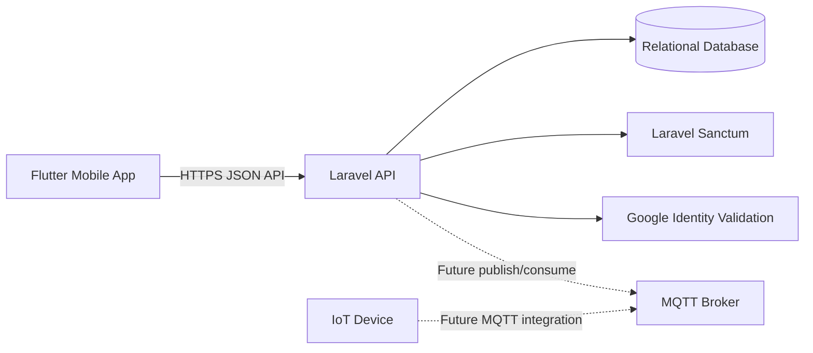
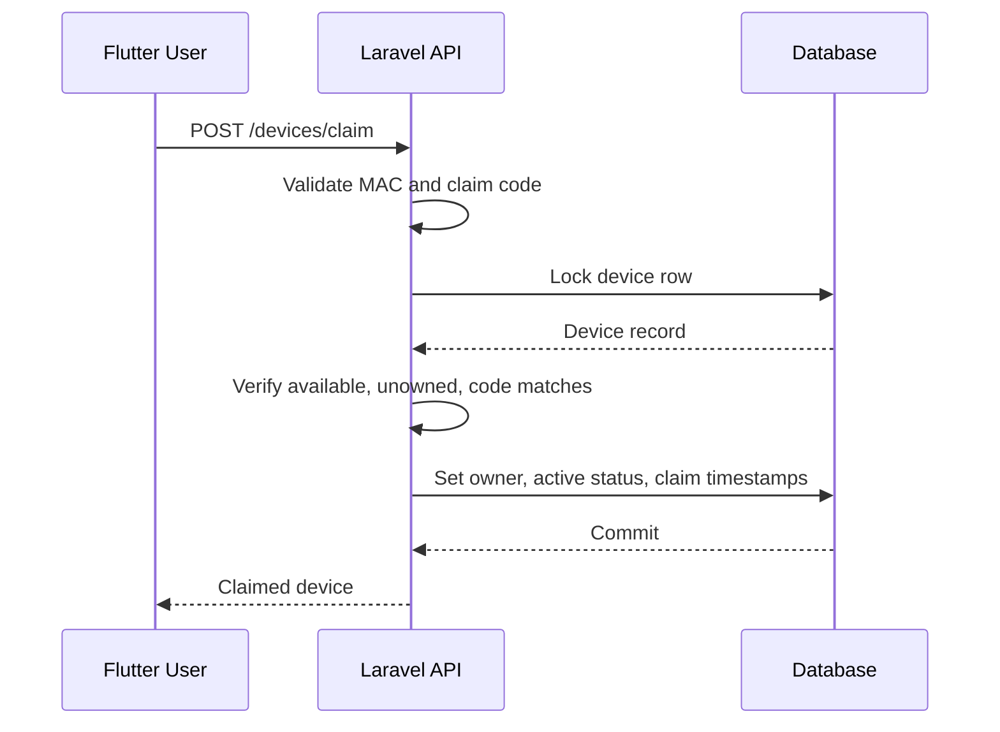
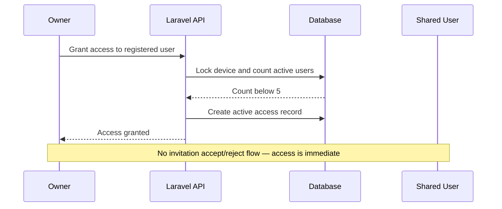

# LNTB Phase 1 System Architecture

## Architecture summary



## Flutter mobile application

Responsibilities:

- Registration and login UI
- Google authentication UI
- Store Sanctum token securely
- Device claim UI
- Device list and details
- Device user management
- Device-control UI
- Control-history UI

## Laravel API

Responsibilities:

- Authentication
- Token issuance (Sanctum, no separate sessions table)
- Validation
- Device claiming
- Device ownership
- Five-user sharing rule
- Authorization
- Device-control command creation
- API Resources
- Error responses

## Database

Responsibilities:

- Users and statuses
- Device inventory
- Device ownership
- Shared access
- Control commands and statuses

The database intentionally does not use foreign-key constraints. The application service layer validates references.

## Recommended request flow

```text
Flutter request
    ↓
Route with auth:sanctum
    ↓
Controller
    ↓
Form Request validation
    ↓
Policy authorization
    ↓
Service transaction/business rules
    ↓
Model/database
    ↓
API Resource response
```

## Device claim sequence



## Shared-access sequence



## Security boundaries

- Flutter holds only the current user token.
- Flutter does not receive device claim-code hashes.
- Flutter does not receive database credentials.
- Laravel validates all access.
- Claim codes are hashed.
- Google OAuth access tokens are validated server-side through Socialite before identity data is trusted.
- Device control is never authorized only by UI state.

## Future extension points

- MQTT broker
- Device credentials
- Telemetry ingestion
- Realtime WebSocket updates
- Push notifications
- Farm and crop modules
- AI assistant
- Computer vision
- Offline synchronization
